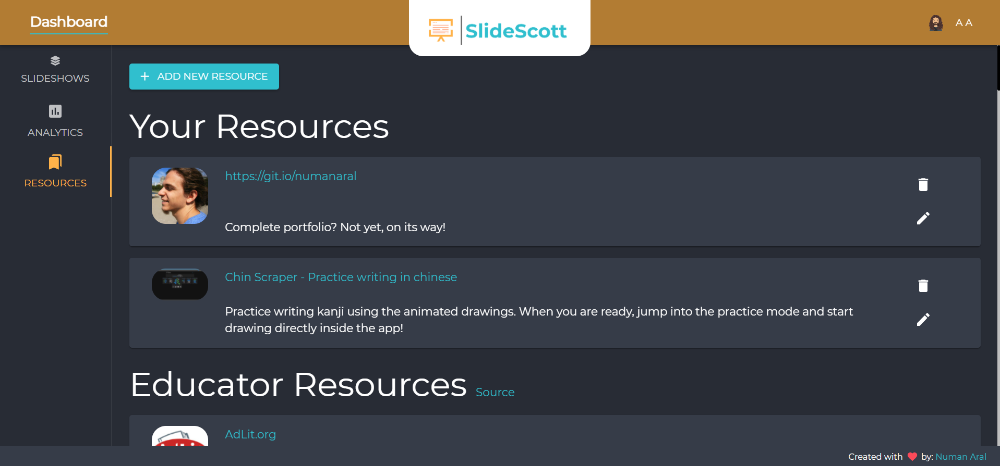
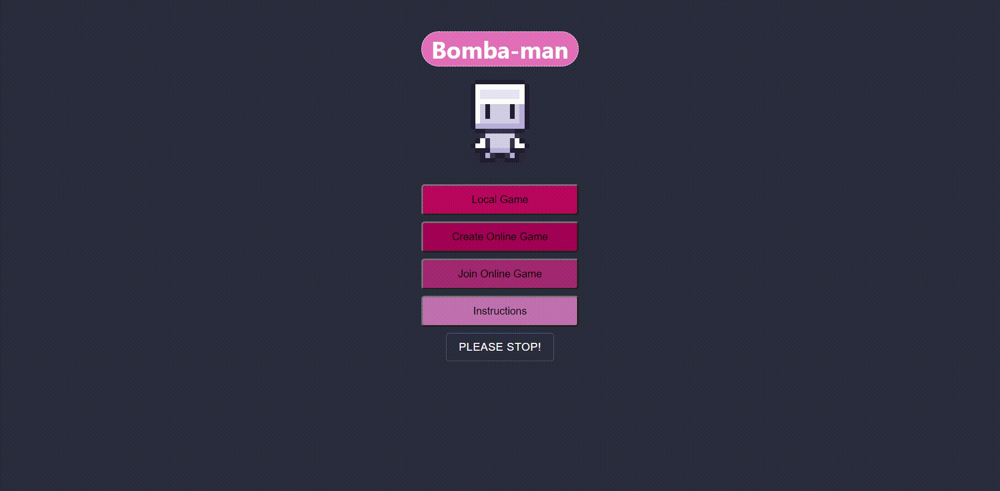
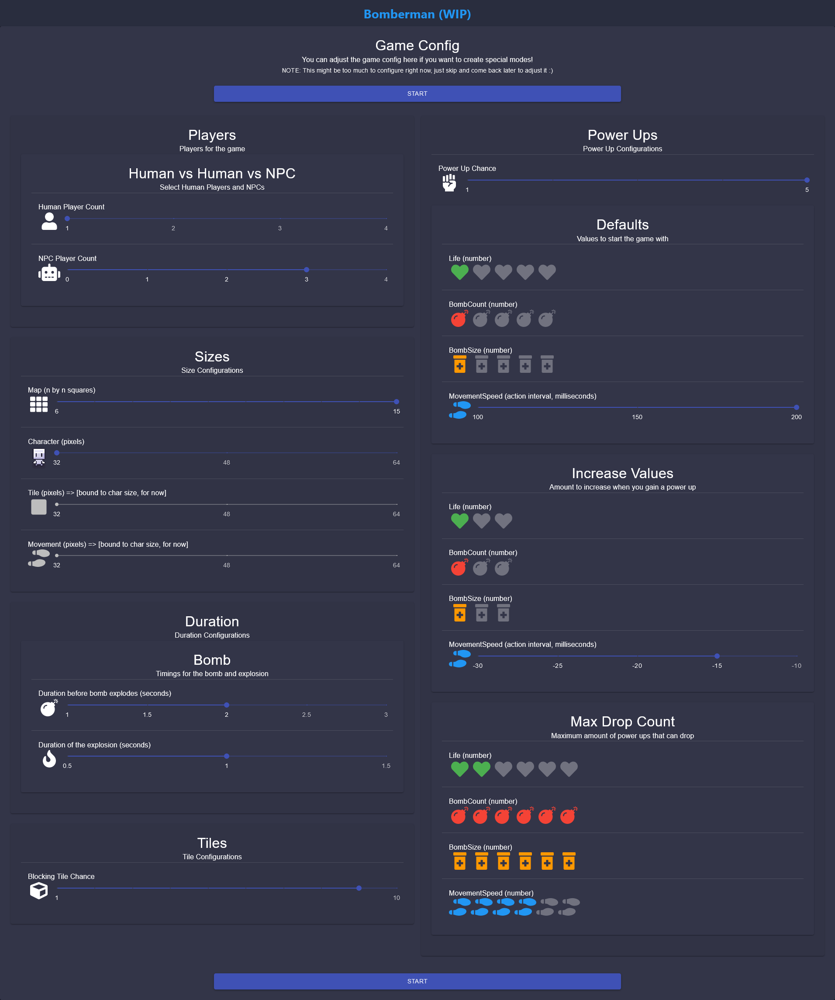
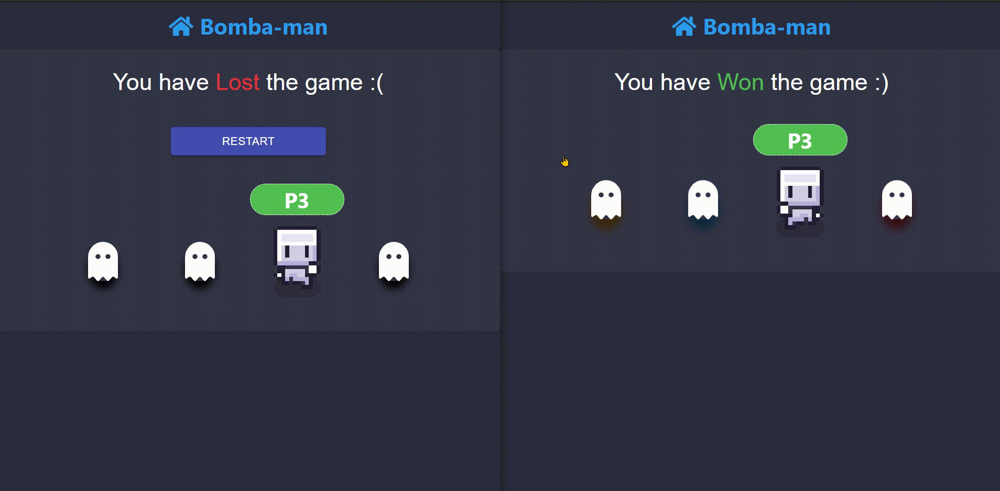
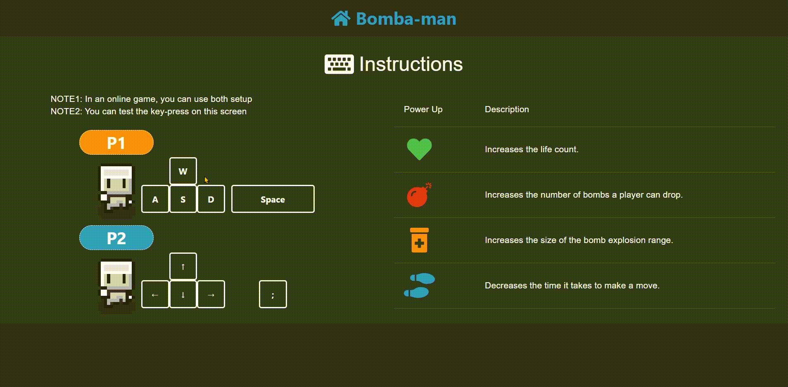

# The following are highlights of some of the projects that I am excited to showcase!

## NOTE:
- Below are the descriptions and some screenshots to display what the apps look like and to give a general overview of the design.
- CANtrackv3 also contains AFTER / BEFORE pictures

## CANtrack v3
- Code & Live site are private, no link to demo :|
- Rewritten our SSR CANtrack (v1 / legacy) from brand new in React as an SPA
- Followed Material UI design
- Fully responsive
- Theme, shortcuts, templates and more customizations
- Also setup a brand new rest API on the backend
- Improved load speeds by taking advantage of the new API, along with smart react components
	- i.e. caching, lazy loading and virtualization
	- From 5-30 seconds load time to immediate loads 

#### Dashboard / Case List

#### BEFORE in v1 / Legacy

&nbsp;

#### Adding a new comment

#### BEFORE in v1 / Legacy

&nbsp;

#### Case Details

#### BEFORE in v1 / Legacy

&nbsp;

#### Comment Details

#### BEFORE in v1 / Legacy

&nbsp;

#### Scheduler

#### BEFORE in v1 / Legacy

&nbsp;

#### Attachments

#### BEFORE in v1 / Legacy

&nbsp;

#### Theme & UI Preferences

&nbsp;

---

&nbsp;

## slide-scott
- Live at: [git.io/slide-scott](https://numanaral.github.io/slide-scott/)
- Code at: [github.com/numanaral/slide-scott](https://github.com/numanaral/slide-scott)
- Project built in CPSC 405 / ENTI 415 course
- First place winner in the end term pitch competition (industry voters)
- Single-handedly built the core project along with "good to have" features under 10 days
	- Team quit on me so had to build it myself
- Real time presentation
	- Cursor, drawings, slides and updates are shared with students in real time
- Interactive components
	- Can answer MC questions, have pop quizzes and collect data for analytics
- ...more
#### Landing

#### First Place Winner

#### Profile

#### Dashboard Page

#### Slide Creator

#### Synchronous Mode / Present (real-time updates)

#### Asynchronous Mode (real-time updates)

#### Analytics

#### Resources

&nbsp;

---

&nbsp;

## bomba-man (Work In Progress)
- Live at: [git.io/bomba-man](https://numanaral.github.io/bomba-man/)
- Code at: [github.com/numanaral/bomba-man](https://github.com/numanaral/bomba-man)
- Fun side project
- Built purely with web without using WebGL or any game library/framework
- Online/Local multi-player
- Configurable game mode
- NPC *(Shoutout to @Pujan Bhatta)*
- Game API built based on factory pattern
	- Any provider can easily extend and create a wrapper following the factory
		- redux (local) and firebase (online) are the two providers as of now
		- Chose firebase for easy setup + easy auth, but a node server with socket.io is what I plan to implement in the future. I didn't want to deploy a server just yet and just get it up and running, firebase can be integrated on a static app so it's perfect to get the ground up.
#### Landing Page

#### Game Screen

#### Experimental 3D (via perspective)

#### Room Creator

#### Waiting Room For Online Multi-Player

#### End Game

#### Instructions

&nbsp;

---

&nbsp;

## chin-scraper
- Live at: [git.io/chin-scraper](https://numanaral.github.io/chin-scraper/)
- Frontend Code at: [github.com/numanaral/chin-scraper](https://github.com/numanaral/chin-scraper)
- Backend Code at: [github.com/numanaral/chin-scraper-backend](https://github.com/numanaral/chin-scraper-backend)
- Another side project, built for helping me and other students learn / practice writing Hanzi (Chinese characters)
- [Details](https://github.com/numanaral/chin-scraper#pages--modules)
- [Why create this?](https://github.com/numanaral/chin-scraper#why-create-this)
#### Landing Page

#### Learn Page

#### Analytics

&nbsp;

---

&nbsp;

## Meng Wei Portfolio
- Live at: [mengwei.ca](https://mengwei.ca/)
- A portfolio site
- Wrote a script to parse images and generate a json map that contains
	- LQIP (Low Quality Image Placeholder) version
	- Caption fetched from the files
- LQIP ensures fast load time along with perfectly matching loading placeholders
- Also gives a nice "blur-effect" on full-screen gallery without using "filter: blur()" and creating a workaround
#### Landing Page

#### Photojournalism Page w/ Gallery

#### Lazy Loading on Gallery

#### LQIP blur-effect on Full-Screen Gallery
